# DCIT_205_IA 

## Introduction

 This is a briefing of a website IA given to us to test our comprehension of the course being taught to us IT and CS students.We were asked to create a 10 page website where each page is dedicated to different aspects of our computer science departments' website. With this we should be able to showcase our comprehension and skils in web development and design.

 ## Instructions

- To clone the project, you go to the repository it is being stored in.
- Fork the repository into your account.
- Copy the repository's URL.
- Open your terminal and navigate to where you want to store the repository.
- Type git clone and paste the URL of the repository you copied.
- Press and enter to clone the project locally.
- Open your IDE to begin work on the project.

## Kathy Frema Agyeman-11263775

## Screenshots

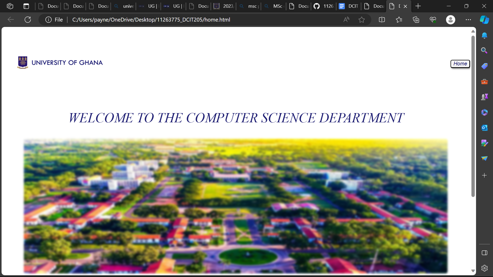
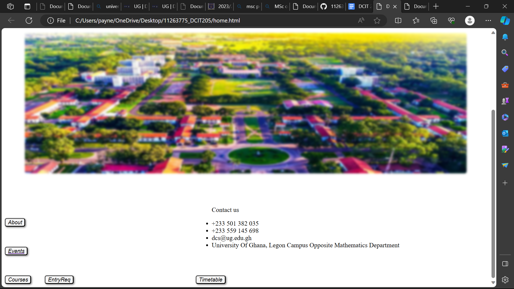
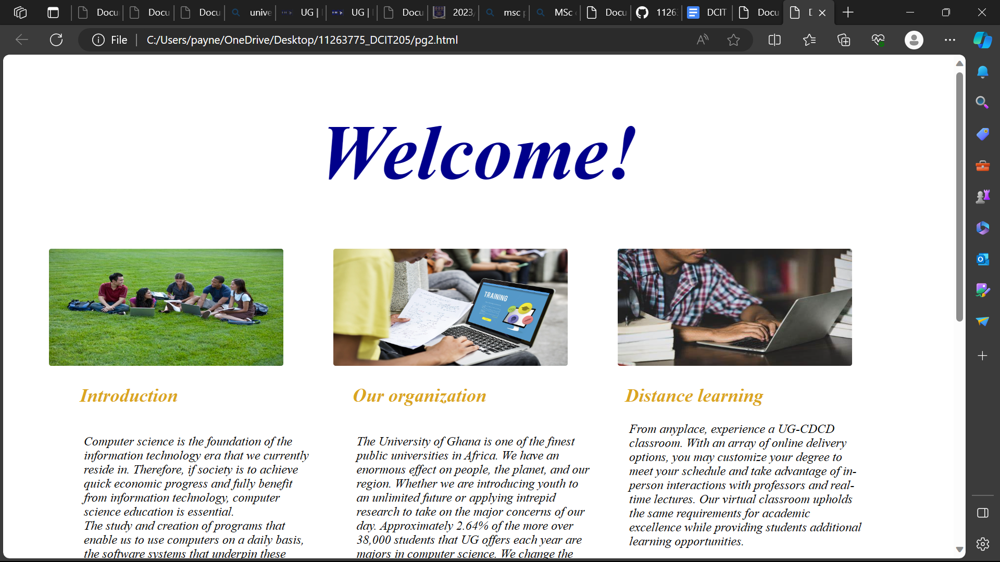
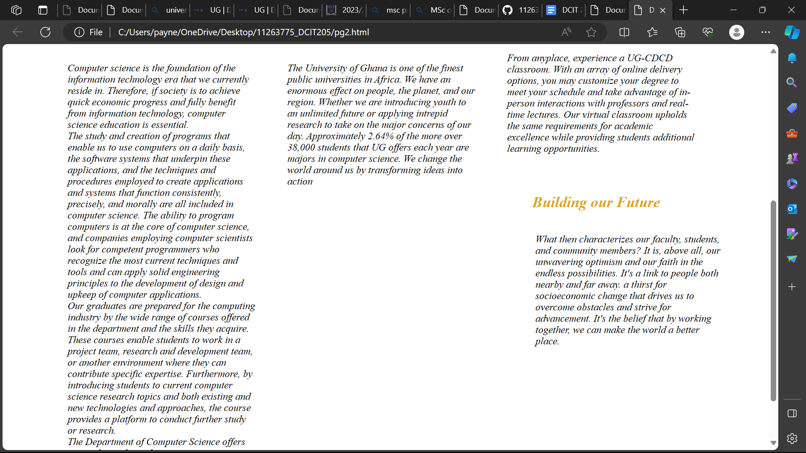
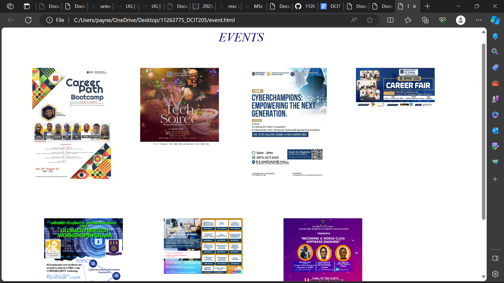

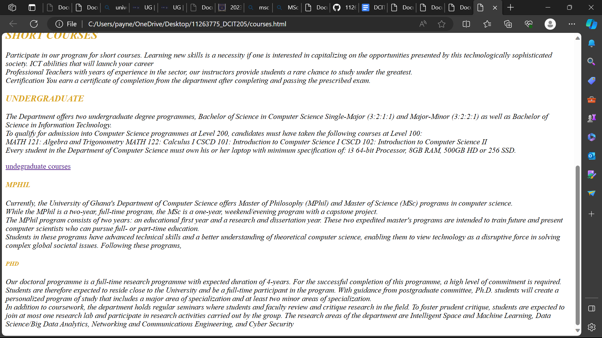
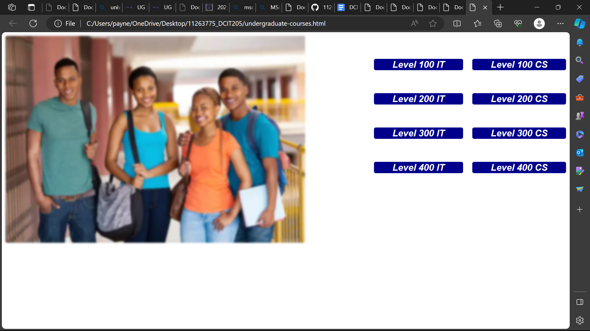
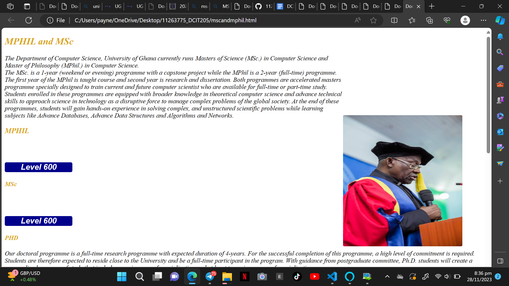
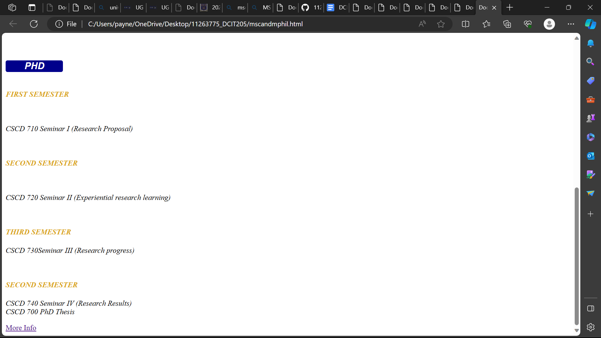
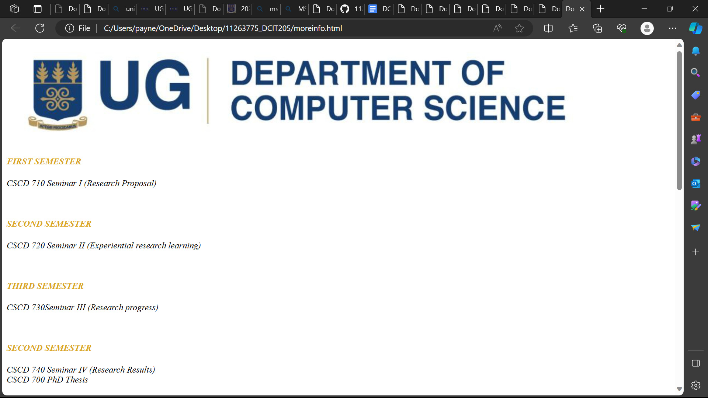
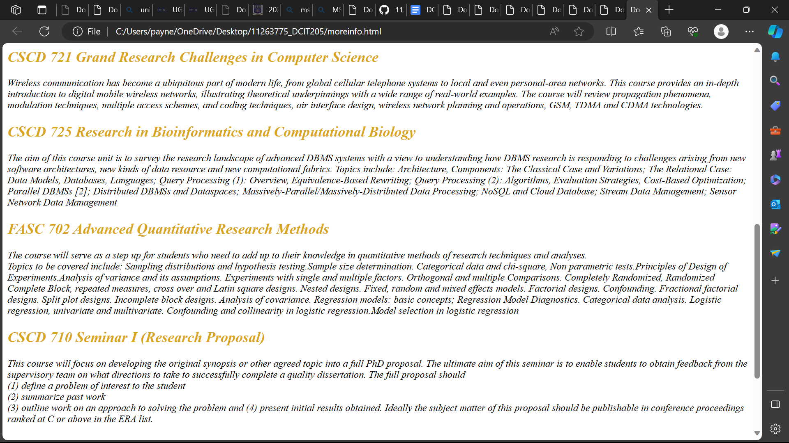
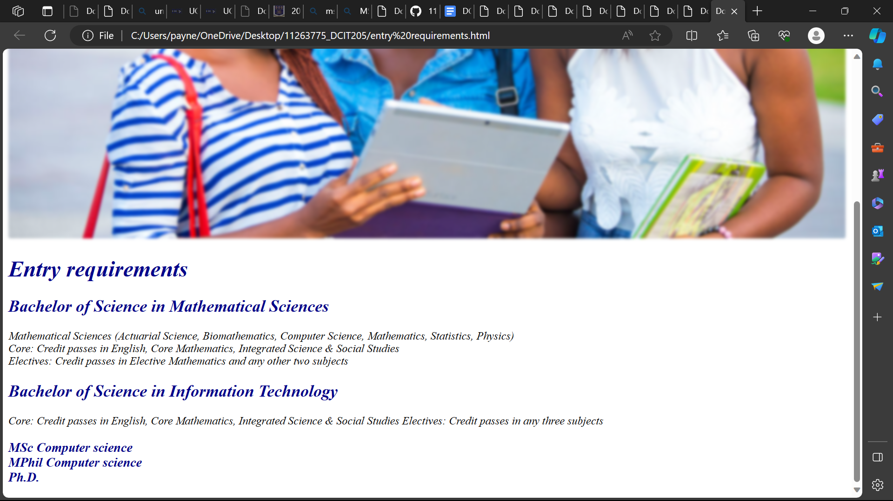
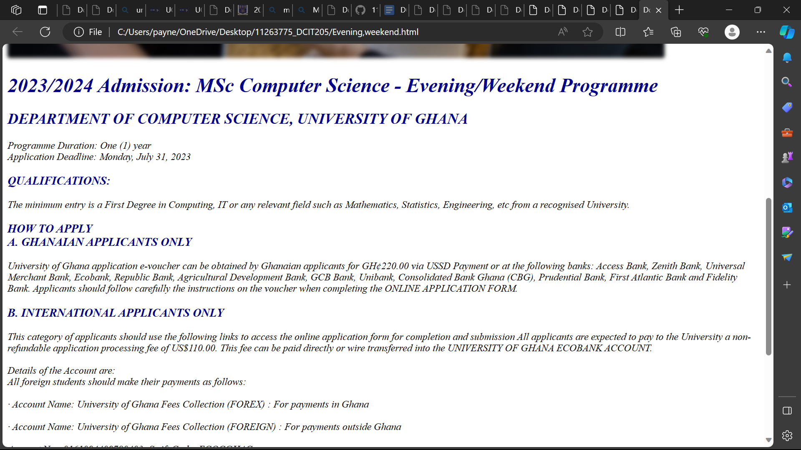
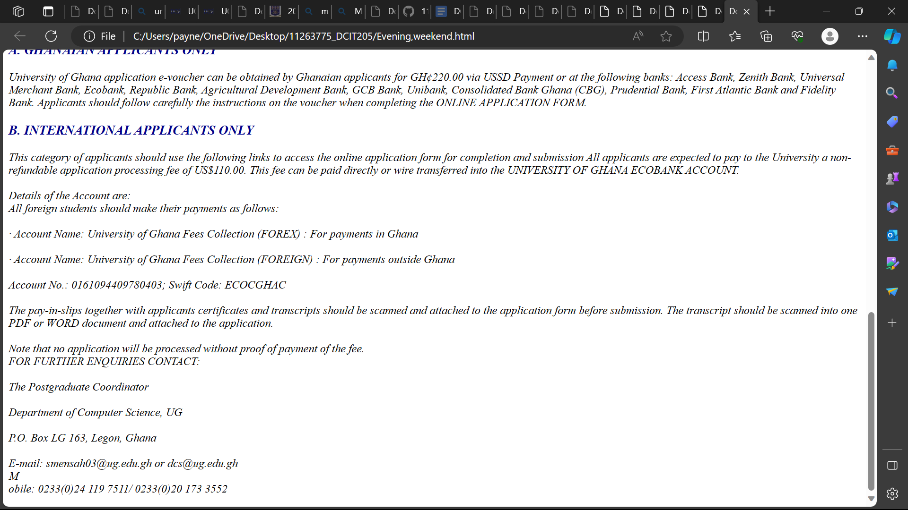
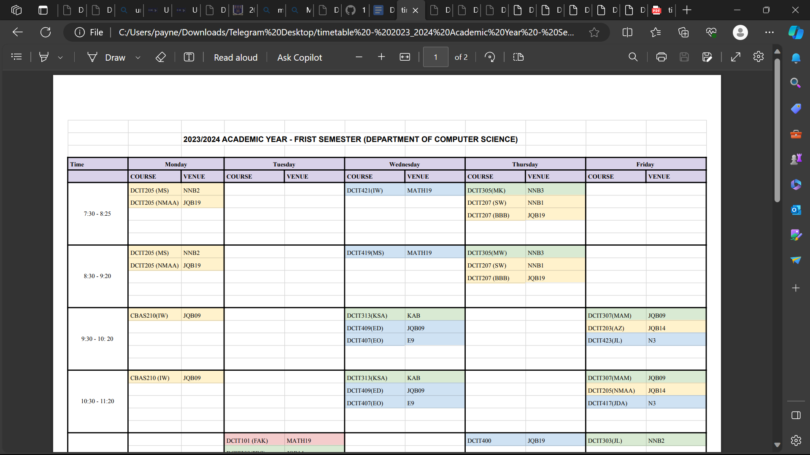
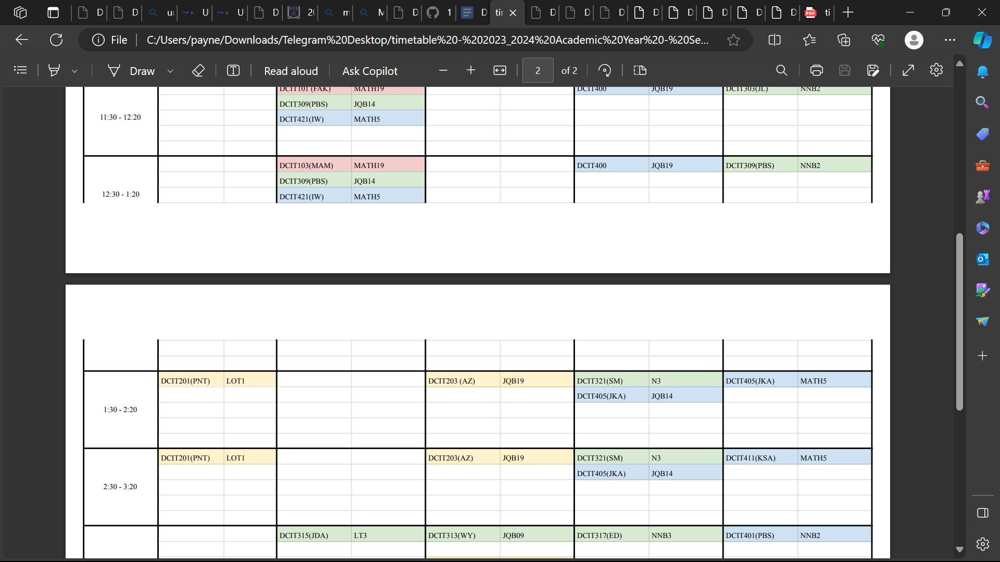

## What I Learnt
First and foremost i learnt how to create a website using css and html. In addition,i learnt how to design the said website. I also acquired knowledge on website and their purposes,composition etc.
